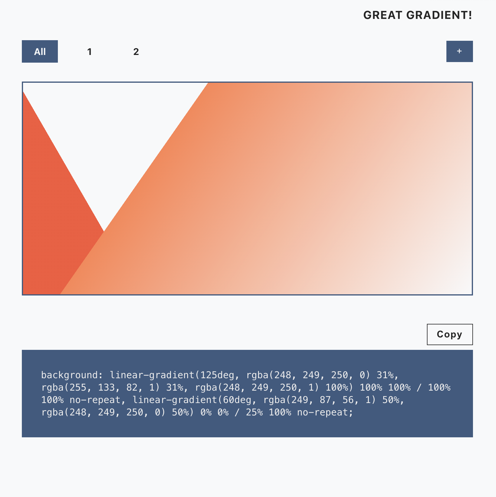

# Great Gradient!

 
 

## About

**Great Gradient!** is a background gradient-generating application. This is a static web tool with no database or user accounts. Inspiration for this site came from the deep rabbit hole of learning how to create css art using a single div.

## Live Demo

A live demo has been deployed on Netlify at [Great Gradient!](https://greatgradient.netlify.app/)

## Features

- Add and remove multiple gradient layers to a background
- Change direction/degrees of gradient
- Add and remove multiple color stops within each gradient layer
- Change the opacity of each color stop
- Resize each gradient layer using `em`, `px`, `%` or `rem` units
- Reposition each gradient layer using `em`, `px`, `%` or `rem` units
- Toggle viewing all gradient layers
- Copy code to clipboard

## Run App Locally

Clone and install: 
`git clone https://github.com/SamDurrant/great-gradient.git`  
`cd great-gradient`  
`npm i`  
`npm start`
